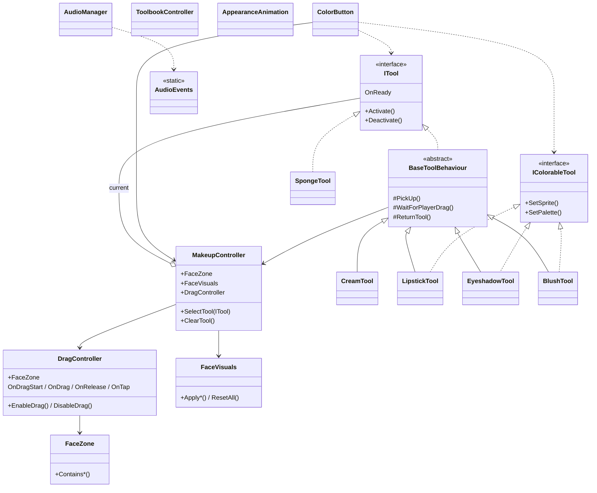

# Playnera Dress Up — макияж (Unity)

Коротко: интерактивный **dress-up / make-up** на мобильном вводе — крем, тени, помада, румяна, сброс губкой, листание «книги» с палитрами. Логика на **UniTask** и **DOTween**, тачи через **Input System** (Enhanced Touch).

## Геймплей

<!-- Сюда вставить гиф: выбор инструмента и первое нанесение (например, крем или кисть). -->

<!-- Сюда вставить гиф: смена цвета / палитры и нанесение другого оттенка. -->

<!-- Сюда вставить гиф: смена инструмента подряд (помада → тени и т.п.) без артефактов. -->

<!-- Сюда вставить гиф: губка / сброс макияжа и повторный выбор инструмента. -->

<!-- Сюда вставить гиф (опционально): листание панели Toolbook стрелками. -->

## Стек

- Unity (URP)
- **DOTween**
- **UniTask**
- **Unity Input System** (Enhanced Touch)

## Запуск

1. Открыть папку проекта в Unity Hub.
2. Открыть стартовую сцену (например, `Assets/Scenes/SampleScene.unity`).
3. Собрать под **Android / iOS** при необходимости (Player Settings → целевая платформа).

## Структура кода (скрипты)

Основная логика лежит в `Assets/Core/Scripts/`:

| Папка   | Назначение |
|---------|------------|
| `Makeup/` | контроллер сцены, лицо, зоны, ввод |
| `Tools/`  | инструменты, интерфейсы `ITool` / `IColorableTool` |
| `UI/`     | кнопки цвета, книга палитр, анимация появления UI |
| `Audio/`  | SFX и события |
| `Utils/`  | расширения (например, твины → UniTask) |

## UML — диаграмма классов (упрощённо)

Связи показаны на уровне «кто от кого зависит / кого реализует». Детали полей и методов смотри в исходниках.

> Если Mermaid на GitHub не отрисовывается, открой `README` в браузере на github.com — диаграмма рендерится там.

## Лицензии сторонних библиотек

Перед публикацией проверь условия **DOTween**, **UniTask** и используемых ассетов (спрайты, звуки).

---

*Тестовое задание / портфолио.*
