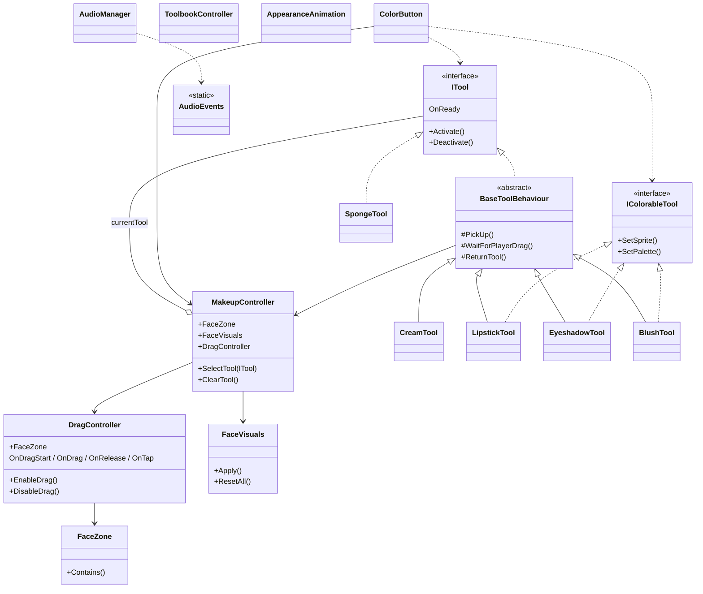

# Playnera Dress Up – Макияж

Интерактивный **dress-up / make-up** для мобильных устройств:  
нанесение крема, теней, помады, румян, сброс губкой, листание книги с палитрами.  
Плавный тач-ввод, приятные анимации и звуки.  

Сделано **за 6 часов** чистого времени.

## Геймплей

  
  

  <b> Слева</b> — нанесение (крем, тени, помада, румяна) + сброс губкой 
  <b> Справа</b> — листание книги палитр + мгновенная смена оттенка/инструмента

**Ключевые технические моменты:**
- Плавные анимации и твины — **DOTween**
- Асинхронная логика без фризов — **UniTask**
- Точный тач-ввод (drag/tap) — **Input System (Enhanced Touch)**
- Чистые переходы между инструментами без артефактов

## Что сделано за 6 часов

- Полный тач-контрол: нанесение макияжа (крем, тени, помада, румяна), смешивание, сброс губкой
- Анимированная книга палитр с листанием стрелками и мгновенной сменой цвета
- Инструменты через интерфейсы `ITool` и `IColorableTool` — удобно добавлять новые
- Звуки при действиях + анимации появления/переходов UI
- Всё оптимизировано под мобильные устройства (Android) на Unity 6 с URP

## Стек

- **Unity 6.3 LTS** (URP 17+)
- **DOTween** — анимации
- **UniTask** — асинхронность
- **Unity Input System** (Enhanced Touch) — мобильный ввод

## Запуск

1. Откройте проект в **Unity Hub** (рекомендуется Unity 6.3+)
2. Загрузите стартовую сцену: `Assets/Scenes/SampleScene.unity`
3. При необходимости соберите под **Android** или **iOS**  
   (Player Settings → Switching Platform)

## Структура кода

Основная логика: `Assets/Core/Scripts/`

| Папка       | Назначение                                      |
|-------------|-------------------------------------------------|
| `Makeup/`   | Контроллер сцены, зоны лица, обработка ввода    |
| `Tools/`    | Инструменты + интерфейсы `ITool` / `IColorableTool` |
| `UI/`       | Кнопки цветов, книга палитр, анимации UI       |
| `Audio/`    | Звуки и события                                 |
| `Utils/`    | Расширения, хелперы (UniTask + DOTween)        |

## UML-диаграмма классов (упрощённая)

> Если Mermaid на GitHub не отрисовывается, откройте `README` в браузере на github.com - диаграмма рендерится там.
---
*Тестовое задание, Playnera.*
